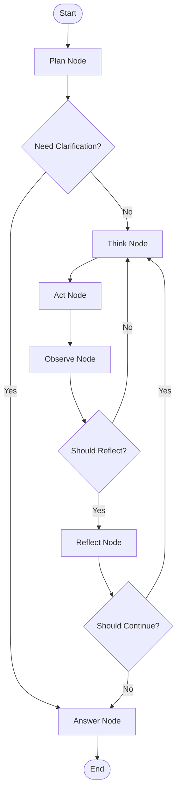

# 🤖 E-Commerce Order Resolution Agent (LangGraph)

A production-grade Agentic AI system built with **LangGraph** for autonomously handling complex, ambiguous, and sometimes contradictory customer queries related to e-commerce orders.

---

## 🚀 What Makes This Special?

🎯 **True Agentic AI** - Plans dynamically, not scripted workflows  
🔄 **Live Order Simulation** - Orders evolve through states in real-time (CSV-based)  
🧠 **Conversation Memory** - Remembers context across multiple questions  
💬 **Concise Answers** - 3-4 sentence responses (no verbose traces)  
⚡ **Groq LLM** - Ultra-fast inference with Llama 3.3 70B  
📚 **RAG-Powered** - Policy-grounded answers with citations  
🛡️ **Bulletproof** - Handles failures, partial data, contradictions gracefully

---

## 💡 How It Works (In Simple Terms)

```
1️⃣ User asks: "My order #98760 is delayed - what's happening?"

2️⃣ Agent PLANS:
   → Identify intents: [order_delay, status_check]
   → Create steps: [validate_id, fetch_status, check_policy, explain]

3️⃣ Agent ACTS:
   → Calls get_order_status("98760") → Reads from orders_db.csv
   → Order state: "in_transit" (updated 5 seconds ago by background thread)
   → Retrieves "Delivery Delay Policy" from vector DB

4️⃣ Agent REFLECTS:
   → Is data sufficient? ✅ Yes
   → Any contradictions? ❌ No
   → Confidence > 0.7? ✅ Yes → Finish

5️⃣ Agent ANSWERS (3-4 sentences):
   "Your order #98760 (Smart Watch) is currently in transit and last
   updated 2 minutes ago. Expected delivery is Dec 29, 2025. According
   to our policy, orders delayed beyond 48 hours qualify for automatic
   refund - yours is still on schedule."
```

**Key Magic:**

- Order #98760 is **not hardcoded** - it's in `orders_db.csv` and changes state every 5 seconds
- Refunds are **dynamically generated** based on order state (cancelled/returned = refund exists)
- Agent **remembers** previous questions in the same conversation thread
- No verbose output - just the final answer

---

## 🎯 Overview

This project implements a **LangGraph-based ReAct (Reason + Act)** agent with **dynamic order lifecycle simulation** that can:

- ✅ Understand user intent (even when incomplete or wrong)
- ✅ Plan multi-step workflows dynamically
- ✅ Decide which tools and knowledge sources to use
- ✅ Handle tool failures, missing data, and policy conflicts
- ✅ Reflect and revise intermediate conclusions
- ✅ **Track orders through realistic state transitions in real-time**
- ✅ **Maintain conversation memory across multiple turns**
- ✅ Produce clear, concise (3-4 sentence), user-safe final responses

## 🏗️ Architecture

```
┌─────────────────────────────────────────────────────────────┐
│                        USER QUERY                           │
└─────────────────────┬───────────────────────────────────────┘
                      │
                      ▼
┌─────────────────────────────────────────────────────────────┐
│           LANGGRAPH STATE GRAPH (ReAct + Memory)            │
│                                                             │
│  START → PLAN → [Clarify?] → THINK → ACT → OBSERVE        │
│             ↓                   ↑            ↓              │
│          ANSWER ←───────── REFLECT ←─────────┘              │
│             ↓                   ↓                           │
│            END            [Continue or Finish?]             │
│                                                             │
│  FEATURES:                                                  │
│  • StateGraph with 6 nodes (plan/think/act/observe/        │
│    reflect/answer)                                          │
│  • MemorySaver checkpointing for conversation memory       │
│  • Thread-based context isolation                          │
│  • Early exit optimization (confidence-based)              │
│  • Concise output (3-4 sentence answers)                   │
│                                                             │
│  CONDITIONAL EDGES:                                         │
│  • Should clarify? → Ask user vs Continue                  │
│  • Should reflect? → Every 3 iterations or on errors       │
│  • Should continue? → More iterations vs Finish            │
└───────────┬─────────────────────────┬───────────────────────┘
            │                         │
            ▼                         ▼
    ┌────────────────┐        ┌────────────────┐
    │  DYNAMIC TOOLS │        │  RAG RETRIEVER │
    │                │        │                │
    │ • Order Sim    │        │ • Policy Embed │
    │ • Refund Gen   │        │ • Retrieval    │
    │ • Inventory    │        │ • Conflict Det │
    │ • CSV Store    │        │                │
    └───────┬────────┘        └────────────────┘
            │
            ▼
    ┌────────────────┐
    │ ORDER SIMULATOR│
    │                │
    │ • Background   │
    │   Thread       │
    │ • State        │
    │   Progression  │
    │ • Time Accel   │
    │ • CSV Persist  │
    └────────────────┘
```

### State Flow Diagram



## 📁 Project Structure

```
AMAZON_AGENT/
├── agent.py                # LangGraph StateGraph with 6 nodes
├── order_simulator.py      # Dynamic order lifecycle simulator ⭐ NEW
├── tools.py                # Dynamic tools (orders, refunds, inventory)
├── retriever.py            # RAG for policy documents
├── run.py                  # CLI interface with conversation memory
├── demo_dynamic.py         # Demonstration of order progression ⭐ NEW
├── config.py               # Configuration settings
├── .env                    # Environment variables (Groq API key)
├── requirements.txt        # Python dependencies
├── orders_db.csv           # Persistent order database ⭐ NEW
├── policies/               # Policy documents for RAG
│   ├── refund_policy.txt
│   ├── delivery_delay_policy.txt
│   ├── return_policy.txt
│   └── charges_and_fees_policy.txt
└── README.md               # This file
```

## 🚀 Quick Start

### 1. Install Dependencies

```bash
pip install -r requirements.txt
```

### 2. Configure Groq API Key

Create a `.env` file or set your Groq API key:

```bash
# .env
GROQ_API_KEY=your_groq_api_key_here
MODEL_NAME=llama-3.3-70b-versatile
```

Get your free Groq API key at: https://console.groq.com/

### 3. Run the Agent

**Interactive Mode:**

```bash
python run.py
```

**Single Query:**

```bash
python run.py "My order #98762 is delayed. What's happening?"
```

**Run Test Queries:**

```bash
python run.py test
```

**See Dynamic Order Progression:**

```bash
python demo_dynamic.py
```

This demonstrates how orders evolve through states in real-time!

## 🧪 Sample Test Queries

The agent is tested with these scenarios:

1. **Order Delay:** "My order #98762 says 'Out for delivery' for 3 days. What's happening?"
2. **Inventory Check:** "Is product P123 available in stock?"
3. **Refund Status:** "I want to check refund status for order 54321."
4. **Missing Order ID:** "Why was I charged extra on my last purchase?" _(Should ask for clarification)_
5. **Multi-Intent:** "My delivery is late and I want a refund — am I eligible?"
6. **Policy Query:** "What is the return window for electronics?"
7. **Contradiction:** "My order is late but refund shows processed. Explain."

## 🔧 Key Features

### 🆕 1️⃣ Dynamic Order Lifecycle Simulation

**No hardcoded data!** Orders are dynamically simulated with realistic state progression:

```python
# Order States (10 total)
PLACED → CONFIRMED → PACKED → DISPATCHED → IN_TRANSIT →
OUT_FOR_DELIVERY → DELIVERED

# Special States
CANCELLED, RETURNED, STUCK (delayed)
```

**Key Features:**

- ⏰ **Time Acceleration:** 1 second = 1 hour (configurable)
- 📁 **CSV Persistence:** `orders_db.csv` stores all orders
- 🔄 **Background Thread:** Updates states every 5 seconds
- 🎲 **Realistic Failures:** 12% stuck, 5% returned, 8% cancelled
- 📦 **Initial Orders:** 7 sample orders created on first run
- 🚚 **Delay Simulation:** Weather, high demand, customs, vehicle issues

**State Transition Times:**

```
placed → confirmed:        1 hour
confirmed → packed:        2 hours
packed → dispatched:       3 hours
dispatched → in_transit:   6 hours
in_transit → out_for_delivery: 24 hours
out_for_delivery → delivered: 4 hours
```

**View Live Data:**

```bash
# Watch orders_db.csv update in real-time
# Or run: python demo_dynamic.py
```

### 2️⃣ Agentic Planning (Not a Script)

The agent generates **structured plans** before acting:

```json
{
  "identified_intents": ["order_delay", "refund_status"],
  "missing_information": [],
  "plan": [
    "Validate order ID",
    "Fetch order status",
    "Check expected vs actual delivery",
    "Retrieve delivery delay policy",
    "Check refund status",
    "Reconcile both results",
    "Generate user-safe response"
  ],
  "confidence": 0.9,
  "requires_clarification": false
}
```

### 🆕 3️⃣ Conversation Memory

The agent maintains **conversation context** across multiple turns:

```python
# Same thread_id = shared memory
agent.run("What's the status of order #98760?", thread_id="user_session_1")
agent.run("What about refunds for that order?", thread_id="user_session_1")
# ↑ Agent remembers we're talking about order #98760
```

**Features:**

- 🧠 **LangGraph MemorySaver:** Persistent checkpointing
- 🔗 **Thread Isolation:** Different users = different threads
- 📝 **Context Preservation:** Previous intents, tool results, reflections
- 🔄 **New Conversation:** Start fresh with new thread_id

**Interactive Mode:**

```bash
python run.py
# Type 'new' to start a fresh conversation
# Type 'exit' to quit
```

### 4️⃣ Dynamic Re-Planning & Reflection

The agent can **revise its plan** mid-execution when:

- Tool outputs contradict each other
- Data is partial or missing
- Assumptions prove incorrect

Example reflection:

> "Expected delivery date has passed, but refund is not initiated. I need to check whether delay qualifies for auto-refund according to policy Section 2."

**Optimization:**

- Reflects every **3 iterations** (not every iteration)
- Skips reflection if tool succeeds
- Early exit if confidence > 0.7 AND sufficient data

### 5️⃣ Unreliable Tools with Graceful Handling

Tools simulate realistic failures:

- ❌ Missing order IDs
- ⚠️ Partial data (incomplete fields)
- 🔄 Inconsistent data (refund exists but order status contradicts)
- 💥 Random API failures (20% rate)

The agent **never crashes** and always explains uncertainty to users.

### 🆕 6️⃣ Dynamic Refund Generation

Refunds are **not hardcoded** — they're generated based on order state:

```python
# Refund Logic
if order_state == "cancelled":
    → Full refund (processed immediately)
elif order_state == "returned":
    → Refund minus $5 restocking fee (processed in 3 days)
elif order_state == "delivered" and random(15%):
    → Return refund initiated (15% chance per query)
else:
    → No refund exists
```

**Features:**

- 💰 Dynamic refund amounts based on order price
- ⏱️ Realistic processing times (initiated vs processed)
- 🎲 Return scenarios for delivered orders
- 📊 Compensation for stuck/delayed orders (future enhancement)

### 7️⃣ RAG with Policy Grounding

The agent:

- Embeds policy documents using sentence transformers
- Retrieves top-k relevant sections
- Detects policy conflicts
- Quotes/paraphrases policies in responses

Example:

> "According to our Delivery Delay Policy Section 2, orders delayed beyond 48 hours from expected delivery may qualify for automatic refund."

### 🆕 8️⃣ Concise Output (3-4 Sentences)

**Old Output (Verbose):**

```
Planning...
Thought: I need to check order status
Action: get_order_status("98760")
Observation: Order found, status is delivered
Reflection: Order is delivered, no issues detected
Final Answer: Your order has been delivered successfully.
```

**New Output (Quiet Mode):**

```
Your order #98760 (Wireless Headphones) was delivered on Dec 19, 2025.
The package should have arrived at your address. If you haven't received
it, please contact support within 48 hours to initiate an investigation.
```

**Control Verbosity:**

```python
agent.run(query, verbose=False)  # Default: quiet mode
agent.run(query, verbose=True)   # Show brief summaries
agent.run(query, debug=True)     # Full trace
```

### 9️⃣ Multi-Intent Handling

Handles multiple intents in a single query:

> "My order 98762 is late, I was charged extra, and I want to know if I can cancel it."

The agent:

- Identifies all three intents
- Determines execution order
- Resolves each systematically

### 🔟 Missing/Wrong User Inputs

The agent intelligently handles:

- Wrong order IDs → Clear error message
- Missing order IDs → Asks for clarification
- Informal language ("my last order") → Uses `get_user_orders` tool

### 1️⃣1️⃣ User-Safe Responses

All responses:

- ✅ Grounded in tool + policy data
- ✅ Explain WHY something happened
- ✅ State uncertainty clearly
- ✅ Offer next steps (wait, refund, escalation)

## 🛠️ Tool Layer

Dynamic tools with realistic behavior and CSV-based data:

| Tool                          | Purpose                | Data Source             | Failure Scenarios                 |
| ----------------------------- | ---------------------- | ----------------------- | --------------------------------- |
| `get_order_status(order_id)`  | Retrieve order details | `orders_db.csv`         | 20% API failure, partial data     |
| `get_refund_status(order_id)` | Check refund info      | Dynamic (state-based)   | No refund if not cancelled/return |
| `get_inventory(product_id)`   | Check stock levels     | `PRODUCT_CATALOG`       | Random stock data omission        |
| `get_user_orders(user_id)`    | Get recent orders      | `orders_db.csv` (query) | Service unavailable scenarios     |

**All tools simulate:**

- 🔴 20% random failures (API timeout, service unavailable)
- 🟡 30% partial data (missing fields)
- ⏱️ Realistic latency (50-200ms delays)
- ✅ Proper status codes (SUCCESS, PARTIAL, ERROR, NOT_FOUND)

## 🧠 LangGraph Agent Decision Flow

### Graph-Based Reasoning

The agent uses **LangGraph's StateGraph** for dynamic, conditional execution:

```
1. PLAN NODE
   ↓
   • Parse query → Identify intents → Create plan
   • Check for missing info
   ↓
   [Conditional: Need clarification?]
   ├─ YES → ANSWER NODE (ask for info) → END
   └─ NO → Continue

2. THINK NODE (ReAct Loop)
   ↓
   • Analyze current state
   • Decide next action based on:
     - Tool results so far
     - Missing information
     - Plan steps
   ↓

3. ACT NODE
   ↓
   • Execute chosen tool/action
   • Parse action from thought
   ↓

4. OBSERVE NODE
   ↓
   • Capture tool results
   • Store in state
   ↓
   [Conditional: Should reflect?]
   ├─ Every 2 iterations → REFLECT
   ├─ On tool errors → REFLECT
   └─ Otherwise → Back to THINK

5. REFLECT NODE
   ↓
   • Detect contradictions
   • Validate assumptions
   • Check confidence
   • Decide if plan needs revision
   ↓
   [Conditional: Continue or finish?]
   ├─ Low confidence + contradictions → THINK (replan)
   ├─ Max iterations reached → ANSWER
   ├─ High confidence (>0.85) → ANSWER
   └─ Otherwise → THINK

6. ANSWER NODE
   ↓
   • Retrieve relevant policies (RAG)
   • Generate user-safe response
   • Quote/paraphrase policies
   • Explain uncertainty
   • Provide next steps
   ↓
   END
```

### State Management

LangGraph maintains **typed state** across all nodes:

```python
class AgentState(TypedDict):
    query: str                          # User's question
    user_id: str                        # User identifier
    identified_intents: List[str]       # Detected intents
    missing_information: List[str]      # What's needed from user
    planned_steps: List[str]            # Execution plan
    iteration_count: int                # Current iteration
    tool_results: Dict[str, Any]        # All tool outputs
    contradictions_found: List[str]     # Detected contradictions
    confidence_score: float             # Current confidence
    final_answer: str                   # Response to user
    last_action: Optional[str]          # Last executed action (CRITICAL!)
    last_action_input: Optional[str]    # Last action input (CRITICAL!)
```

**Note:** The `last_action` and `last_action_input` fields are critical for tool execution. LangGraph only preserves fields declared in the TypedDict — missing these caused the "Unknown tool: None" bug.

### Conditional Edges (Dynamic Routing)

The graph uses **conditional edges** for adaptive behavior:

1. **Clarification Check**: `plan → answer` if missing info
2. **Reflection Trigger**: `observe → reflect` every 3 iterations or on errors
3. **Continuation Decision**:
   - `reflect → think` to continue exploring
   - `reflect → answer` if confidence > 0.7 OR max iterations (15) reached
4. **Early Exit**: Stops at iteration 10 if confidence > 0.7 AND tool results available

## 🔍 RAG Strategy

1. **Embedding:** Policy documents chunked (500 tokens, 50 overlap) and embedded using `sentence-transformers/all-MiniLM-L6-v2`
2. **Storage:** ChromaDB vector store for efficient retrieval
3. **Retrieval:** Top-3 most relevant policy chunks for each query
4. **Conflict Detection:** Identifies contradictory policies from different sources
5. **Grounding:** Responses always cite or paraphrase retrieved policies

## ⚠️ Error Handling Strategy

The agent handles errors gracefully at multiple levels:

1. **Tool Level:** Returns structured `ToolResult` with status (SUCCESS, PARTIAL, FAILURE, NOT_FOUND)
2. **Agent Level:** Reflects on errors and adapts plan
3. **User Level:** Explains uncertainty and offers alternatives

Example:

```

Tool returned: "Order service temporarily unavailable"
Agent reflection: "Cannot fetch order details. Should retrieve policy for general delay guidance."
User response: "I'm currently unable to access your specific order details due to a system issue. However, based on our Delivery Delay Policy, orders delayed beyond 48 hours typically qualify for refunds. Please try again in a few minutes or contact support at..."

```

## 🎨 Technology Stack

- **LLM:** Groq (Llama 3.3 70B) - Ultra-fast inference
- **Agent Framework:** LangGraph with StateGraph + MemorySaver
- **Order Simulation:** Custom CSV-based lifecycle simulator with background threading
- **RAG:** sentence-transformers + ChromaDB
- **Embeddings:** all-MiniLM-L6-v2 (sentence-transformers)
- **CLI:** Rich library for beautiful terminal UI
- **Language:** Python 3.8+
- **Persistence:** CSV for orders, ChromaDB for vector storage

## 📊 Evaluation Criteria

This project demonstrates:

✅ **Agentic Reasoning:** Dynamic planning with LangGraph StateGraph, not fixed pipelines  
✅ **Tool Orchestration:** Handles failures, partial data, contradictions gracefully  
✅ **RAG Quality:** Policy grounding with conflict detection and citation  
✅ **Error Handling:** Never crashes, explains uncertainty clearly  
✅ **UX Judgment:** Clear, empathetic, actionable 3-4 sentence responses  
✅ **System Design:** Modular, extensible, production-ready architecture  
✅ **Engineering Trade-offs:** Groq for speed, LangGraph for memory, CSV for simplicity  
✅ **Dynamic Simulation:** Realistic order lifecycle with time progression (not hardcoded!)  
✅ **Conversation Memory:** Multi-turn context via LangGraph checkpointing  
✅ **Optimized Performance:** Early exit, reduced reflection frequency, concise output

## 🔮 Future Enhancements

- [x] Multi-turn conversations with memory ✅ **COMPLETED**
- [x] Dynamic order simulation (not hardcoded) ✅ **COMPLETED**
- [x] Optimized concise output (3-4 sentences) ✅ **COMPLETED**
- [ ] Integration with real e-commerce APIs
- [ ] A/B testing different reflection strategies
- [ ] Fine-tuned embedding models for policy retrieval
- [ ] Web UI with conversation history
- [ ] Multi-language support
- [ ] Agent performance analytics dashboard
- [ ] Compensation logic for delayed orders
- [ ] Stock level dynamics (inventory depletion)

## 📝 License

MIT License - feel free to use and modify for your projects!

## 🙏 Acknowledgments

Built with ❤️ using:

- **Groq** for blazing-fast LLM inference
- **LangGraph** for StateGraph and conversation memory
- **ChromaDB** for vector storage
- **sentence-transformers** for embeddings
- **Rich** for beautiful terminal UI

---

---

## 🔧 Troubleshooting

### "Unknown tool: None" Error

**Fixed!** This was caused by missing `last_action` and `last_action_input` fields in AgentState TypedDict. LangGraph only preserves declared fields.

### Groq API Rate Limit

Free tier: 100,000 tokens/minute. If you hit the limit, wait ~90 seconds or use a different API key.

### Orders Not Progressing

The background thread updates every 5 seconds. Wait at least 6 seconds between queries to see state changes. Time multiplier: 1 second = 1 hour.

### Verbose Output

Use `verbose=False` (default) in `agent.run()`. Set `verbose=True` for summaries or `debug=True` for full traces.

### CSV Not Found

On first run, `orders_db.csv` is auto-created with 7 sample orders. Delete it to regenerate fresh orders.

---

## 🎬 Quick Demo

```bash
# 1. See dynamic order lifecycle
python demo_dynamic.py

# 2. Try the agent interactively
python run.py

# Sample queries:
# > What's the status of order #98760?
# > What about refunds for that order?  (uses memory!)
# > My order is delayed - what should I do?
```

**Watch orders evolve:**

- Orders progress through states every 5 seconds (background thread)
- Check `orders_db.csv` to see real-time updates
- Run `demo_dynamic.py` multiple times to observe state changes

---

**Note:** This is a demonstration project for an AI coding assignment. The tools simulate realistic e-commerce APIs with dynamic data from CSV storage.

```

```
